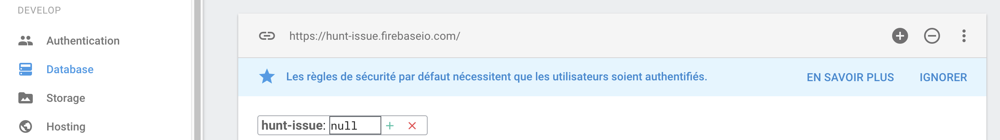
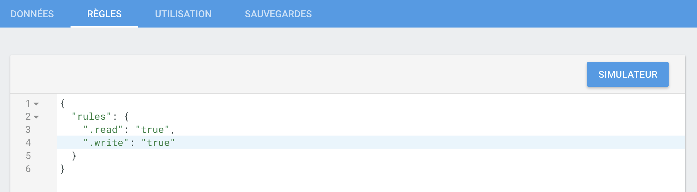

# Hunt Issue


## About the plugin

Hunt Issue is a WordPress plugin. After the instalation, it will create a tab "Hunt Issue" in your admin side menu. Insert new issue, delete it, clear all issues done !
#### All the issues inserted are saved in your database.

## Step 1

```bash
git clone https://github.com/arnaudmanaranche/Hunt-Issue.git
```

## Step 2

### Register an app on <a href="https://www.firebase.com/">Firebase</a>

After this step, go on the "Database" tab in the side menu and catch the link of your database app :



## Step 3 

:exclamation: Set the rules ".read" and ".write" on "true" :exclamation:



## Step 4

### Go to the project folder

```bash
Hunt-Issue/js/main.js
```

And replace the variable with the link you catched previously

```JS
var hunt_issue = new Firebase("https://hunt-issue.firebaseio.com");
```
## Report a bug

Feel free to open an issue <a href="https://github.com/arnaudmanaranche/Hunt-Issue/issues">here</a> !
